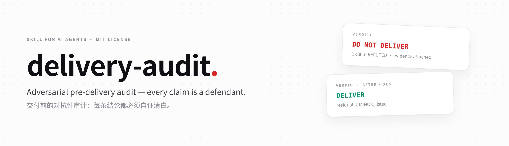
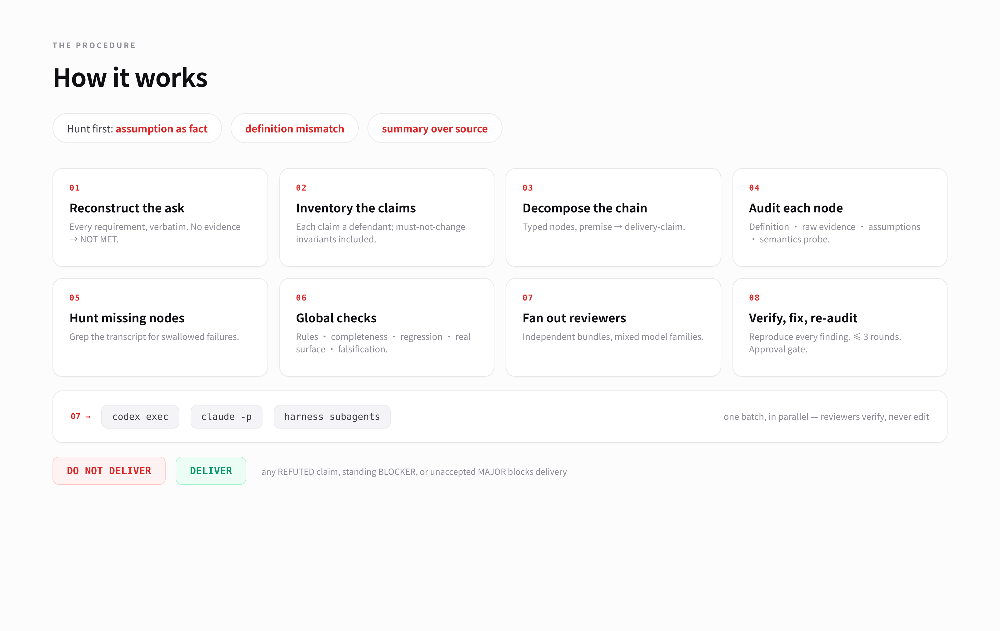
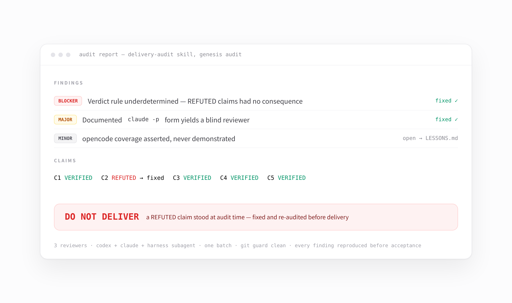

<div align="center">
  
  <p>
    <a href="LICENSE"></a>
    
    
  </p>
  <p><b>English</b> · <a href="README.zh-CN.md">简体中文</a></p>
</div>

# delivery-audit

An adversarial pre-delivery audit skill for AI coding agents. Before any non-trivial work is delivered, the skill decomposes the whole task into a typed reasoning chain, re-derives every claim from raw evidence, and fans the audit out to independent reviewers (Codex CLI, Claude CLI, harness subagents) — because the executing model is trained to agree with the user and with itself.

> The delivery is wrong until proven right. Neither the transcript's claims nor the user's premises count as evidence. Only fresh, reproduced observations count.

## Why

Most real delivery failures are three kinds — the skill hunts them before anything else:

| Failure class | What it looks like |
|---|---|
| **臆想 — assumption as fact** | "should", "normally", "it prints 0 when done" — never checked |
| **口径错误 — definition mismatch** | the progress counter reads 0 because every job crashed, not because the run finished |
| **没看原始证据 — summary over source** | conclusions drawn from dashboards while the trace that would refute them sits unopened |

## How it works



Eight steps: reconstruct the ask verbatim → inventory every claim (including must-not-change invariants) → decompose the reasoning chain into typed nodes → audit each node against raw evidence → grep the transcript for swallowed failures → global checks (rules, completeness, regression impact, real surface, falsification) → fan out parallel reviewers → reproduce every finding, fix, re-audit (≤ 3 rounds).

## The verdict contract

- **BLOCKER** — the output can be wrong, or a required step cannot run.
- **MAJOR** — materially misleading, or will mislead a fresh executor, while the core result stands.
- **MINOR** — wording or polish with no behavioral consequence.

`DO NOT DELIVER` while any of these stands: a BLOCKER finding · any REFUTED claim · any UNVERIFIED load-bearing claim · any MAJOR neither fixed nor explicitly accepted by the user · the fix loop hitting its three-round cap. Otherwise `DELIVER`, listing residual MINOR issues.



## Parallel reviewers

Each audit fans out one fresh reviewer per independent bundle — one batch, never serialized — with a facts-and-pointers audit packet (never a prose summary: the summarizer is the defendant and will omit its own failures):

```bash
codex exec --ephemeral --sandbox workspace-write -C <project-root> "<instructions>"
claude -p --allowedTools "Read,Grep,Glob,Bash" < /tmp/reviewer-prompt.txt
```

Reviewers must run real commands (a read-only sandbox makes verification theatrical) but never edit source; a `git status --porcelain` guard before and after turns any unexpected change into a finding.

## Approval gate

**All changes need prior approval.** Before changing anything — source, configs, scripts, tests, or data/state files — the auditor reports to the user and waits for explicit approval, leading with 后果 (what happens if unfixed) → 产生后果的原因 (the cause) → 修改方案 (the proposed patch). Applying a change and then reporting it is a violation, however small.

## Install

Copy `SKILL.md` into the skills directory of each agent ecosystem you use:

```bash
git clone https://github.com/QiaoyiZheng/delivery-audit.git
cd delivery-audit

for d in ~/.agents/skills ~/.claude/skills ~/.codex/skills \
         ~/.pi/agent/skills ~/.qoder/skills ~/.omp/agent/skills; do
  mkdir -p "$d/delivery-audit" && cp SKILL.md "$d/delivery-audit/SKILL.md"
done
```

Every installed agent picks it up on its next session start.

## Usage

This skill **never runs automatically** — invoke it explicitly:

> "用 delivery-audit 审一下这次交付" · "audit this before we deliver" · "复核这个结果"

## Repository layout

```
delivery-audit/
├── SKILL.md            # the skill — the entire audit procedure
├── README.md           # this file
├── README.zh-CN.md     # 简体中文
├── LICENSE             # MIT
└── assets/             # README images (+ HTML sources in assets/src/)
```

## Lessons workflow

Lessons from live audits accumulate in a local `LESSONS.md` (maintained alongside the canonical install, **never committed or published**) with `[open]` / `[folded]` status. The owner reviews them periodically; accepted lessons get folded into `SKILL.md`, re-synced to all install locations, and pushed. Until folded, orchestrators should read the local `LESSONS.md` before running an audit.

## License

[MIT](LICENSE) © 2026 QiaoyiZheng
