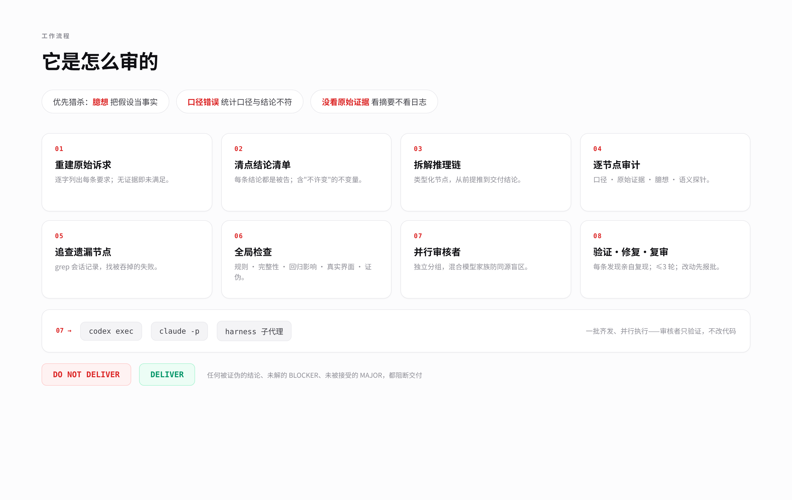
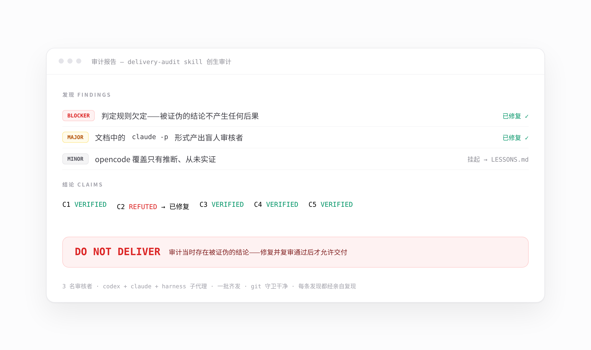

<div align="center">
  
  <p>
    <a href="LICENSE"></a>
    
    
  </p>
  <p><a href="README.md">English</a> · <b>简体中文</b></p>
</div>

# delivery-audit

一个面向 AI 编码代理的**交付前对抗性审计** skill。在任何非平凡工作交付之前，它把整个任务拆解成一条类型化推理链，逐条用原始证据重新推导，并把审计并行分发给独立审核者（Codex CLI、Claude CLI、宿主子代理）——因为执行模型被训练成迎合用户、也迎合它自己。

> 交付在被证伪之前就是错的。transcript 的陈述和用户的前提都不算证据；只有现场重新执行的观测才算。

## 为什么需要它

真实交付的失败几乎都来自三类——skill 优先猎杀它们：

| 失败类型 | 长什么样 |
|---|---|
| **臆想**（把假设当事实） | "应该是""正常情况下""它跑完会输出 0"——从未验证 |
| **口径错误**（定义不匹配） | 进度计数为 0，是因为所有任务都崩了，而不是跑完了 |
| **没看原始证据**（看摘要不看源头） | 对着仪表盘下结论，能否定它的 trace 一直没被打开 |

## 工作流程



八个步骤：逐字重建原始诉求 → 清点每条结论（含"不许变"的不变量）→ 把推理链拆成类型化节点 → 逐节点对照原始证据审计 → grep 会话记录找被吞掉的失败 → 全局检查（规则、完整性、回归影响、真实界面、证伪）→ 并行审核者齐发 → 每条发现亲自复现、修复、复审（≤3 轮）。

## 判定契约

- **BLOCKER**——产出可能是错的，或规定步骤根本无法运行。
- **MAJOR**——有实质误导，或会误导一个没有本次会话背景的重新执行者，但核心结论仍成立。
- **MINOR**——纯措辞打磨，无行为后果。

以下任何一条成立即为 `DO NOT DELIVER`：存在 BLOCKER 发现 · 任何结论被证伪 · 任何承重结论未验证 · 存在未修复且未被用户明确接受的 MAJOR · 修复循环触顶三轮。否则 `DELIVER`，并列明残余 MINOR。



## 并行审核者

每个独立分组派一名全新审核者，**一批齐发，绝不串行**；分发的必须是"事实+指针"的审计包，不是散文摘要——总结者就是被告，它会省略自己的失败：

```bash
codex exec --ephemeral --sandbox workspace-write -C <项目根目录> "<指令>"
claude -p --allowedTools "Read,Grep,Glob,Bash" < /tmp/reviewer-prompt.txt
```

审核者必须能跑真实命令（只读沙箱会让验证沦为表演），但绝不许改源码；前后各跑一次 `git status --porcelain`，任何意外改动本身即发现。

## 审批门禁

**一切改动都需要事先批准。** 改动任何东西之前——源码、配置、脚本、测试、数据文件——审计者必须向用户报告并等待明确批准，格式固定为：后果（不修会怎样）→ 产生后果的原因 → 修改方案。先改后报即违规，无论改动多小。

## 安装

把 `SKILL.md` 拷进你使用的每个代理生态的 skills 目录：

```bash
git clone https://github.com/QiaoyiZheng/delivery-audit.git
cd delivery-audit

for d in ~/.agents/skills ~/.claude/skills ~/.codex/skills \
         ~/.pi/agent/skills ~/.qoder/skills ~/.omp/agent/skills; do
  mkdir -p "$d/delivery-audit" && cp SKILL.md "$d/delivery-audit/SKILL.md"
done
```

已安装的代理在下次会话启动时自动发现。

## 使用

本 skill **永不自动触发**——需要显式调用：

> "用 delivery-audit 审一下这次交付" · "audit this before we deliver" · "复核这个结果"

## 仓库结构

```
delivery-audit/
├── SKILL.md            # skill 本体——全部审计流程
├── README.md           # English
├── README.zh-CN.md     # 本文件
├── LICENSE             # MIT
└── assets/             # README 图片（HTML 源文件在 assets/src/）
```

## 教训工作流

实战审计的教训记入本地 `LESSONS.md`（随规范安装位置维护，**永不提交、永不发布**），状态标记 `[open]` / `[folded]`。owner 定期审阅，接受的教训折入 `SKILL.md`、同步到所有安装位置并推送。折入之前，编排者运行审计前应先读本地 `LESSONS.md`。

## 许可

[MIT](LICENSE) © 2026 QiaoyiZheng
